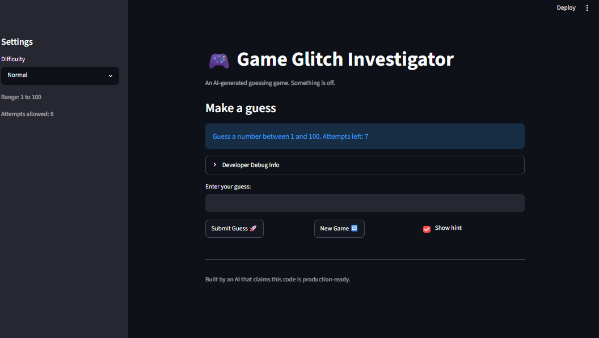

# 💭 Reflection: Game Glitch Investigator

Answer each question in 3 to 5 sentences. Be specific and honest about what actually happened while you worked. This is about your process, not trying to sound perfect.

## 1. What was broken when you started?

- What did the game look like the first time you ran it?
- List at least two concrete bugs you noticed at the start  
  (for example: "the hints were backwards").

The first time I ran the game, I saw the following screen. I was given a prompt where I have to guess a number between 1 and 100. 
  

Concrete Bug #1: The "Show hint" button does not have the same styling as the other new buttons ("Submit Guess" and "New Game")

Concrete Bug #2: The Attempts allowed on the left hand side of the screen does not match the attempts left in the prompt (8 vs 7)

Concrete Bug #3: Clicking on the New Game Button did not reset the game to its initial state. 

Concrete Bug #4: Using the Enter button into the "Enter your guess:" box does not make a submission to the 

Concrete Bug #5: Negative numbers specified count as an attempt and are recorded.

Concrete Bug #6: Numbers over the specified range (i.e 100)

**Bug Reproduction Log**

Document at least 3 bugs you found. Add rows as needed.

| Input | Expected Behavior | Actual Behavior | Console Output / Error |
|-------|-------------------|-----------------|------------------------|
|-1|The program would mark this as an invalid value|This program marks this as a valid value| None |
| 10000 | The program would mark this as an invalid value| This program marks this as a valid value | None |
| Enter into text box | The program would process the action similiar to when we click on Submit guess | No action is recorded from the program  | None |
| 30 | The text box would list it as "Go Lower" | The text box mentions it as going higher | Go HIGHER! (Answer is listed as 19) |
| 23 | The text box would list it as "Go Higher" | The text box mentions it as going Lower | Go LOWER! (Answer is listed as 94) |
| Off by One | When starting the project, one of the guesses is already used. This is seen in the Attempts left for Normal as an example. | Attempts left != Attempts allowed in sidebar | None |
| Clicking on New Game | Once clicked, a new game would be available, resetting it to what was it initially on startup | it stayed the same, requiring the entire application to be refreshed | Error |
| 1.52 | It should default to the higher number (In this case, 2 should be entered) or be marked as invalid | This was marked in history under 1 | Marked as 1 in History |
| Switching difficulty | Switching difficulty should generate a new secret number, reset the attempts, and notify the user that this was done | The same secret is still set, the number of attempts allowed/already guessed does not change | Error |
---

Which bugs do we fix? 

Off by One error for number of guesses
Issue with hints being wrong (30, 23) 
Moving functions over from app.py to logic_utils.py

## 2. How did you use AI as a teammate?

- Which AI tools did you use on this project (for example: ChatGPT, Gemini, Copilot)?

I used Claude Code for this project. In addition, I used 

- Give one example of an AI suggestion that was correct (including what the AI suggested and how you verified the result).

I prompted Claude Code for an fix to the off-by-one error. For my prompt, I marked the areas/parts that had odd behavior (in this case the disconnect between the sidebar text
and the number of guess in the main screen). The AI suggested changing one of the variables wtihin app.py to start from zero instead of one. This was verified by compiling the program and viewing the behavior soon after. This was an easy fix, and thus, this was marked as correct within my commits. 

- Give one example of an AI suggestion that was incorrect or misleading (including what the AI suggested and how you verified the result).

One AI suggestion that was misleading was when the initial changes proposed by Claude Code was to adjust the app.py file only rather than moving the functions needed for the program to function to logic_utils. When proposed with the changes, I found it insuffiencient and added additional context and a message foro Claude to factor in these fixes.

---

## 3. Debugging and testing your fixes

- How did you decide whether a bug was really fixed?

I decided whether a bug was fixed completly by comparing the recorded behavior before the fix with the behavior after the fix was provided. Prior to testing, I make a gut-check the explanation by Claude with my knowledge of programming. 

We then move to testing with testing the program itself manually. If multiple aspects of the code was changed in Claude Code or if the bug touches multiple parts, I use Pytest to run the test suite and confirm that the bug in question was really fixed. 

- Describe at least one test you ran (manual or using pytest)  
  and what it showed you about your code.

I ran a manual test to fix the hints and refactor the logic utilities for the guessing game to logic_utils.py. After Claude Code suggested the change and refactor,  I accepted it and proceed to test this manually by playing through the game and used the bug reproduction log to recreate the error. 

This showed that while Claude can make changes to fix an error, the code still needs to be checked manually. 

- Did AI help you design or understand any tests? How?

I think AI helped me design and understand the tests I created, especially in regards to edge cases and program flow. This would allow me in the future to generate additional tests. In addition, the abstraction of certain functions to logic_utils.py helped me to determine further functions that I could move or compartmentalize to other files, such as score or the startup logic. 
---

## 4. What did you learn about Streamlit and state?

- How would you explain Streamlit "reruns" and session state to a friend who has never used Streamlit?

---

## 5. Looking ahead: your developer habits

- What is one habit or strategy from this project that you want to reuse in future labs or projects?
  - This could be a testing habit, a prompting strategy, or a way you used Git.
- What is one thing you would do differently next time you work with AI on a coding task?

- In one or two sentences, describe how this project changed the way you think about AI generated code.

AI generated code works well when given a template or guidelines, either with comments, spec files, or a framework provided by the user. Even when the fixes are implemented, 
